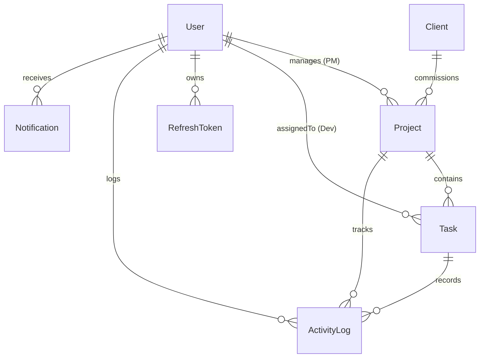

# PulseAgency — Real-Time Client Project Dashboard

A production-grade full-stack web application designed for digital agencies to orchestrate client projects, manage workflows with strict multi-tier Role-Based Access Control (RBAC), and stream project telemetry and presence over WebSockets in real time.

---

## Technical Stack

- **Frontend:** React 19, TypeScript, Vite, Tailwind CSS, Lucide Icons, Date-fns
- **Backend:** Node.js, Express, TypeScript, Socket.io, node-cron, bcryptjs, jsonwebtoken, Zod
- **Database & ORM:** PostgreSQL, Prisma ORM
- **Authentication:** Short-lived JWT Access Tokens (15-min expiry) + Cryptographically Hashed Refresh Tokens in HttpOnly Cookies (7-day expiry)
- **Deployment:** Docker, Docker Compose, Nginx, Render/Railway/Vercel compatible

---

## Architectural Decisions & Justifications

### 1. WebSocket Library Choice: Socket.io vs Native WebSockets
We selected **Socket.io** over native WebSockets for four production-critical reasons:
1. **Targeted Room Multiplexing:** Built-in room abstractions (`admin_global`, `project_{id}`, `pm_{id}`, `user_{id}`) allow role-filtered dispatch without manually tracking and looping over raw socket descriptor arrays.
2. **Heartbeat & Presence Telemetry:** Robust reconnection heuristics, automatic fallback to HTTP long-polling behind strict corporate firewalls, and reliable disconnect lifecycle events for live user presence counts.
3. **Handshake Authentication:** Intercepts JWT tokens directly at the handshake middleware layer, preventing unauthorized socket connections before socket events can ever be emitted.
4. **Binary & JSON Serialization:** Clean, typed event messaging without manual `JSON.parse`/`JSON.stringify` boilerplate on every frame.

### 2. Overdue Task Background Scheduler: node-cron vs BullMQ
We opted for **node-cron** for the scheduled background task evaluator:
- **Zero External Infrastructure Dependency:** BullMQ requires an operational Redis broker cluster. For an agency dashboard where task due dates are evaluated on minute-interval cadences, introducing Redis adds unnecessary operational cost and points of failure.
- **Idempotent Batch Querying:** The cron job runs an indexed query `WHERE dueDate < NOW() AND status != 'DONE' AND isOverdue = false`. This guarantees zero duplicate activity logs or spurious notifications, executing in single-digit milliseconds directly inside the PostgreSQL index.
- *Trade-off Note:* If horizontal multi-instance scaling of the Node.js backend is required in the future, BullMQ or a distributed leader-election lock (e.g. Redlock or PostgreSQL advisory locks `pg_try_advisory_lock`) would be used.

### 3. Token Storage & Security Architecture
- **Refresh Token (HttpOnly Cookie):** Stored in a strict `HttpOnly`, `SameSite=Lax`, `Secure` (in production) cookie scoped to `/api/auth`. This renders the refresh token completely inaccessible to client-side JavaScript, eliminating the risk of token exfiltration via Cross-Site Scripting (XSS).
- **Hashed in Database:** The raw refresh token is hashed with SHA-256 before being stored in the database. Even in the event of an internal DB dump, attackers cannot reuse refresh tokens.
- **Access Token (In-Memory / Authorization Header):** Short-lived (15 minutes), containing `{ id, email, role, name }`. Automatically refreshed in the background when an API request receives a 401 response.

---

## Database Schema & Indexing Strategy



### Relational Schema Design
1. **`User`**: `id` (UUID), `email` (Unique), `passwordHash`, `name`, `role` (`ADMIN` | `PROJECT_MANAGER` | `DEVELOPER`), `avatarUrl`.
2. **`RefreshToken`**: `id`, `tokenHash` (Unique SHA-256), `userId` (FK cascade), `expiresAt`, `revokedAt`.
3. **`Client`**: `id`, `name`, `company`, `email` (Unique).
4. **`Project`**: `id`, `name`, `description`, `clientId` (FK cascade), `managerId` (FK restrict), `status` (`ACTIVE` | `COMPLETED` | `ARCHIVED`).
5. **`Task`**: `id`, `taskNumber` (Autoincrementing INT), `title`, `description`, `projectId` (FK cascade), `assignedToId` (FK set null), `status` (`TODO` | `IN_PROGRESS` | `IN_REVIEW` | `DONE`), `priority` (`LOW` | `MEDIUM` | `HIGH` | `CRITICAL`), `dueDate`, `isOverdue` (Boolean).
6. **`ActivityLog`**: `id`, `projectId` (FK cascade), `taskId` (FK cascade), `userId` (FK cascade), `action`, `previousState`, `newState`, `message`, `createdAt`.
7. **`Notification`**: `id`, `userId` (FK cascade), `title`, `message`, `link`, `isRead` (Boolean), `createdAt`.

### Indexing Rationale
- `Task(projectId, status)`: B-Tree compound index. Projects typically have dozens of tasks; this index enables immediate filtering by status without table scans.
- `Task(assignedToId, status)`: Optimizes Developer queries fetching only their active assigned tasks.
- `Task(dueDate, isOverdue)`: Specifically optimizes the background overdue scheduler which frequently queries `dueDate < NOW() AND isOverdue = false`.
- `ActivityLog(projectId, createdAt DESC)` & `ActivityLog(userId, createdAt DESC)`: Critical for the 20-event missed activity catchup query, avoiding high-cost disk sorting.
- `Notification(userId, isRead, createdAt DESC)`: Supports instant badge count queries (`count(isRead=false)`) and recent notification drawer retrieval.

---

## Role-Based Access Control (RBAC) Matrix

Every protected route enforces security at the **controller & database query level**, not just frontend element hiding:

| Action / Resource | Admin | Project Manager | Developer |
|---|:---:|:---:|:---:|
| View Global Activity Feed | Full (All Projects) | Filtered (Own Projects Only) | Filtered (Assigned Tasks Only) |
| Create Project & Assign Client | Yes | Yes | No (403 Forbidden) |
| View / Edit Project | All Projects | Own Projects Only | Assigned Task Projects Only |
| Create & Assign Tasks | Yes | Own Projects Only | No (403 Forbidden) |
| Edit Task Title / Priority / Due Date | Yes | Own Projects Only | No (403 Forbidden) |
| Update Task Status | Yes | Own Projects | Yes (Assigned Tasks Only) |
| Delete Tasks / Projects | Yes | Own Projects Only | No (403 Forbidden) |
| Live WebSocket Online Count | Yes | Yes | Yes |

---

## Project Structure (Clean Monorepo)

The project adheres to a strict clean folder structure with **zero JavaScript files in the root directory**. All test suites are written in pure TypeScript within `backend/tests/`:

```
realtime-client-dashboard/
├── backend/
│   ├── prisma/
│   │   ├── schema.prisma          # PostgreSQL relational schema & indexes
│   │   └── seed.ts                # Database seed script (7 users, 3 projects, 18 tasks)
│   ├── src/
│   │   ├── config/                # env.ts, database.ts
│   │   ├── controllers/           # auth, project, task, activity, notification, stats, client, user
│   │   ├── middleware/            # auth.ts, rbac.ts, validate.ts, errorHandler.ts
│   │   ├── routes/                # Modular Express routers
│   │   ├── services/              # taskService, projectService, activityService, notificationService, statsService
│   │   ├── jobs/                  # overdueScheduler.ts (node-cron scheduler)
│   │   ├── sockets/               # socketHandler.ts (handshake auth, presence, room routing)
│   │   ├── utils/                 # jwt.ts, response.ts
│   │   └── index.ts               # HTTP & WebSocket server entry point
│   ├── tests/
│   │   └── rbac_and_realtime.test.ts # Pure TypeScript integration & RBAC test suite
│   ├── Dockerfile
│   ├── package.json
│   └── tsconfig.json
├── frontend/
│   ├── src/
│   │   ├── components/            # Navbar, ActivityFeed, TaskCard, TaskFilterBar, NotificationDropdown, Modals
│   │   ├── context/               # AuthContext.tsx, SocketContext.tsx
│   │   ├── pages/                 # LoginPage.tsx, DashboardPage.tsx, ProjectsPage.tsx, TasksPage.tsx
│   │   ├── services/              # api.ts (token refresh & typed endpoints)
│   │   ├── types/                 # index.ts (strictly typed domain models)
│   │   ├── App.tsx
│   │   ├── main.tsx
│   │   └── index.css
│   ├── Dockerfile
│   ├── package.json
│   └── vite.config.ts
├── docker-compose.yml             # Single-command container deployment
├── README.md                      # Architecture, indexing rationale & engineering deep-dive
└── package.json                   # Root package.json with test / build / dev scripts
```

---

## Seed Data Accounts

The database includes 7 users, 3 clients, 3 projects, 18 tasks (including 3 in overdue state), and 10 pre-existing activity entries.

Default password for all accounts: **`Password123!`**

| Name | Role | Email | Permitted Scope |
|---|---|---|---|
| **Elena Vance** | `ADMIN` | `admin@agency.com` | Full agency oversight, all projects, global feed |
| **Alex Mercer** | `PROJECT_MANAGER` | `pm1@agency.com` | Manages Projects A & B, assigns tasks, reviews |
| **Sarah Connor** | `PROJECT_MANAGER` | `pm2@agency.com` | Manages Project C, isolated from PM1 |
| **Ravi Kumar** | `DEVELOPER` | `dev1@agency.com` | Assigned tasks in Proj A, B, C; updates status |
| **Marcus Chen** | `DEVELOPER` | `dev2@agency.com` | Assigned tasks; owns Overdue Task #3 |
| **Aisha Patel** | `DEVELOPER` | `dev3@agency.com` | Assigned tasks; owns Overdue Task #13 |
| **Leo Rodriguez** | `DEVELOPER` | `dev4@agency.com` | Assigned tasks across projects |

---

## Quickstart & Local Setup

### Option 1: One-Command Docker Setup (Recommended)
Prerequisites: Docker & Docker Compose.

```bash
# Clone the repository
git clone <repository_url>
cd realtime-client-dashboard

# Build and start PostgreSQL, Backend API, and Frontend SPA
docker-compose up --build
```
- Open `http://localhost` in your browser.
- Backend API is available at `http://localhost:5000`.

---

### Option 2: Local Bare-Metal Setup
Prerequisites: Node.js (v18+), PostgreSQL running on `localhost:5432`.

1. **Setup Backend:**
   ```bash
   cd backend
   npm install

   # Configure .env (or adjust with your local PostgreSQL password)
   cp .env.example .env

   # Push schema to PostgreSQL & seed demo data
   npx prisma db push
   npx prisma db seed

   # Start backend dev server
   npm run dev
   ```

2. **Setup Frontend:**
   ```bash
   cd ../frontend
   npm install

   # Start Vite dev server
   npm run dev
   ```
   Open `http://localhost:5173`.

---

### Option 3: Production Deployment on Vercel

The repository includes complete configurations for deploying to Vercel (`vercel.json`, `frontend/vercel.json`, `api/index.ts`, and cross-origin cookie/CORS support).

#### Recommended Production Architecture: Decoupled Full-Stack
Because WebSockets (`Socket.io`) and in-process task schedulers require persistent, long-lived TCP connections, the recommended cloud architecture is:
1. **Frontend on Vercel:** Global edge CDN for the Vite React SPA.
2. **Backend on Render / Railway / Fly.io / Docker:** Persistent Node.js container for WebSockets and `node-cron`.
3. **Database on Neon / Supabase / AWS RDS:** Managed PostgreSQL.

**Deployment Steps:**
1. **Deploy Backend (e.g. Render / Railway / VPS):**
   - Connect repository, specify root directory `backend`.
   - Build command: `npm run build` (runs `prisma generate && tsc`).
   - Start command: `npm start`.
   - Environment variables:
     - `DATABASE_URL`: PostgreSQL connection string with SSL.
     - `JWT_ACCESS_SECRET`: Secure random string.
     - `JWT_REFRESH_SECRET`: Secure random string.
     - `CLIENT_URL`: `https://your-app.vercel.app`
     - `NODE_ENV`: `production`
2. **Deploy Frontend to Vercel:**
   - Import repository into Vercel, set root directory to `frontend` (or keep root with `vercel.json`).
   - Framework preset: **Vite**.
   - Output directory: `dist`.
   - Environment variables:
     - `VITE_API_URL`: Your backend API URL (e.g., `https://your-backend.onrender.com`).
     - `VITE_WS_URL`: Your backend WebSocket URL (e.g., `https://your-backend.onrender.com`).
   - Client-side routing is handled automatically via `frontend/vercel.json` rewrites.

#### Direct Single-Repo Vercel Deployment
You can also deploy the entire repository directly on Vercel using the included root `vercel.json` and `api/index.ts` serverless adapter:
- REST API routes (`/api/*`), RBAC security middleware, and database operations execute via Vercel Serverless Functions.
- The overdue task scheduler executes automatically via Vercel Cron (`/api/cron/overdue` configured in `vercel.json`).
- *Note regarding Serverless WebSockets:* Vercel Serverless Functions terminate after HTTP responses; for live bi-directional WebSocket feeds and presence, point `VITE_WS_URL` to a persistent Node host.

---

## Running Automated Verification Tests

A dedicated end-to-end integration and RBAC security test suite (written in pure TypeScript) is included. Run directly from the root directory:

```bash
npm test
```
Executes 21 assertions covering:
- Authentication & JWT issuance
- Cross-PM isolation (PM1 attempting to access or modify PM2's project yields 403 Forbidden)
- Developer boundary enforcement (cannot create projects, cannot view/edit other dev tasks, cannot modify task title/priority)
- Task status transition and database activity logging
- Missed event catchup query filtering
- Notification badge count verification
- Dashboard aggregations & live presence

---

## Engineering Deep-Dive: Real-Time Role-Filtered Feed & Distributed Architecture

> **Architecture Spotlight: Zero-Data-Leakage Role-Filtered Telemetry**
>
> The core architectural challenge was engineering an airtight, real-time activity feed that guarantees zero data leakage across roles without sacrificing WebSocket dispatch throughput. Because an agency handles confidential client work, broadcasting raw event payloads to a shared WebSocket room was unacceptable.
>
> To solve this, the application implements a multi-tier socket routing topology combined with database-level query scoping. On connection, the server authenticates the JWT handshake and automatically enrolls sockets into targeted rooms: Admins join `admin_global`, Project Managers join `pm_{managerId}` and their managed project rooms, and Developers join `user_{devId}` and rooms for projects containing their assigned tasks. When a task status transition occurs, the server persists the transition in an indexed `ActivityLog` table within a transaction, formats the event string ("*Ravi moved Task #12 from In Progress → In Review*"), and selectively dispatches it to `admin_global`, the specific `project_{projectId}`, and the assigned developer's room. For offline catchup, the client requests `/api/activity/feed?limit=20`, where Prisma applies strict role-based WHERE clauses, querying the database rather than ephemeral memory.
>
> **Future Scalability Considerations:** At higher enterprise scale, Redis Pub/Sub serves as the adapter for Socket.io (`@socket.io/redis-adapter`). While in-process room routing and `node-cron` are ultra-efficient for single-instance deployments, multi-instance horizontal scaling utilizes Redis to synchronize presence and broadcast events across backend cluster nodes.

---

## Known Limitations

1. **Horizontal Scaling of Sockets:** Presence and WebSocket rooms currently utilize in-process memory maps. For a multi-node cluster, a Redis adapter (`@socket.io/redis-adapter`) would be added.
2. **Cron in Clustered Environments:** If multiple instances of the backend are spawned behind a load balancer, multiple cron workers would execute simultaneously. Mitigated by using BullMQ or PostgreSQL advisory locks.
